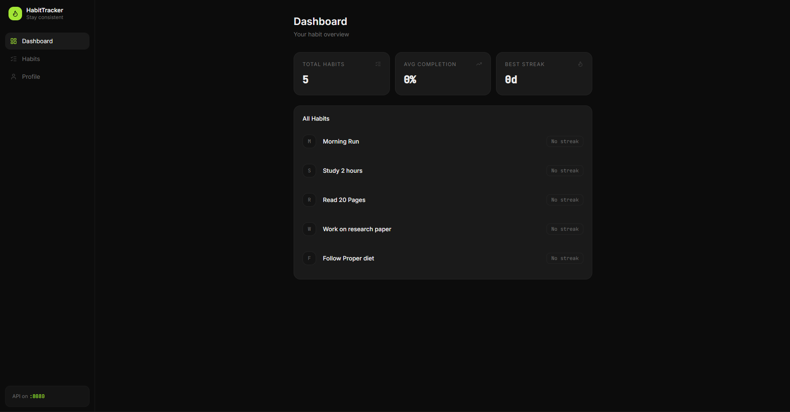
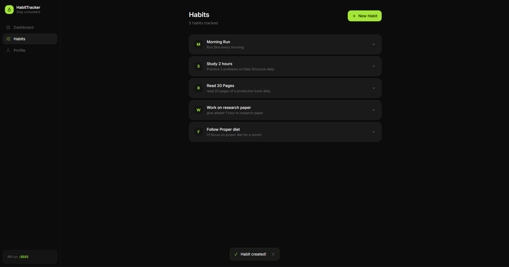
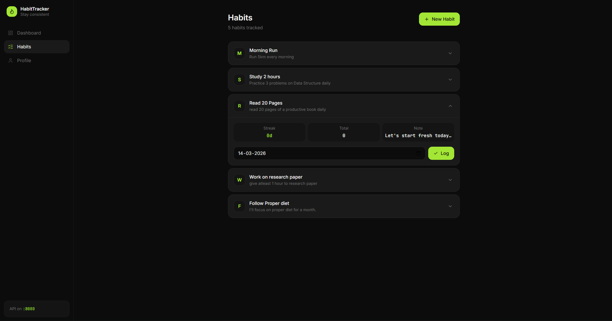

# Smart Habit Tracker

A backend REST API built with Spring Boot for tracking daily habits, calculating streaks, and viewing completion analytics.


## Screenshots








> Backend only, frontend is currently in progress.

---

## What it does

Users can register, create habits they want to track, and log their daily completions. The system automatically calculates streaks and provides completion rate analytics per habit. Duplicate logs for the same date are prevented at the database level using composite unique constraints.

---

## Features

- **User registration** — Create a user account
- **Habit management** — Create and manage habits per user
- **Daily logging** — Mark a habit as completed for a specific date
- **Streak calculation** — Automatically calculates how many consecutive days a habit was completed
- **Analytics** — Completion rate and consistency score per habit
- **Global error handling** — Consistent error responses across all endpoints
- **DTO-based responses** — User data is never directly exposed from entities

---

## Tech Stack

| Technology | Purpose |
|---|---|
| Java 17 | Core language |
| Spring Boot 3.x | Backend framework |
| Spring Data JPA | Database access |
| Hibernate | ORM implementation |
| MySQL 8.0 | Relational database |
| Maven | Build tool |

---

## Run Locally

**Prerequisites:** Java 17, MySQL 8, Maven

```bash
# Clone the repo
git clone https://github.com/Suryaguptaa/Smart-habit-tracker.git
cd Smart-habit-tracker/SmartHabbitTracker

# Create the database
mysql -u root -p
CREATE DATABASE habit_tracker_db;
exit

# Update MySQL credentials in src/main/resources/application.properties

# Run
mvn spring-boot:run
```

Server starts at `http://localhost:8080`

---

## API Reference

### Users

```
POST   /api/users/register        Register a new user
```

**Request:**
```json
{
  "name": "Surya Gupta",
  "email": "surya@example.com"
}
```

---

### Habits

```
POST   /api/habits                 Create a new habit
GET    /api/habits/user/{userId}   Get all habits for a user
```

**Create habit request:**
```json
{
  "userId": 1,
  "name": "Morning Run",
  "description": "Run 3km every morning"
}
```

---

### Tracking & Analytics

```
POST   /api/habits/{id}/log        Mark habit as completed for a date
GET    /api/habits/{id}/streak     Get current streak count
GET    /api/habits/{id}/analytics  Get completion rate and stats
```

**Log habit request:**
```json
{
  "date": "2026-03-15"
}
```

**Streak response:**
```json
{
  "habitId": 1,
  "currentStreak": 7,
  "longestStreak": 14
}
```

**Analytics response:**
```json
{
  "habitId": 1,
  "totalDaysLogged": 20,
  "completionRate": "71%",
  "currentStreak": 7
}
```

---

## Project Structure

```
src/main/java/
├── entity/         User, Habit, HabitLog
├── repository/     Spring Data JPA repositories
├── service/        Business logic, streak calculation
├── controller/     REST endpoints
├── dto/            Request and response objects
└── exception/      GlobalExceptionHandler
```

---

## Author

**Surya Dev Gupta**
6th Semester — Lakshmi Narain College of Technology Excellence

---

## License

MIT License — see [LICENSE](LICENSE) for details.